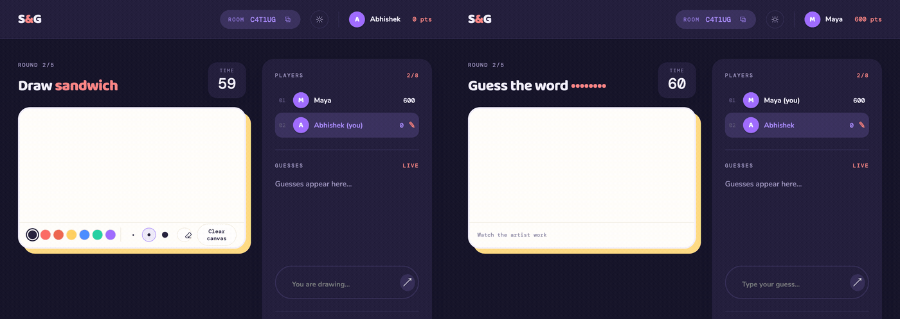
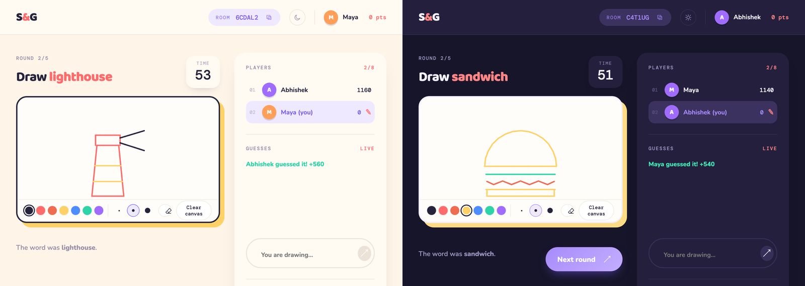
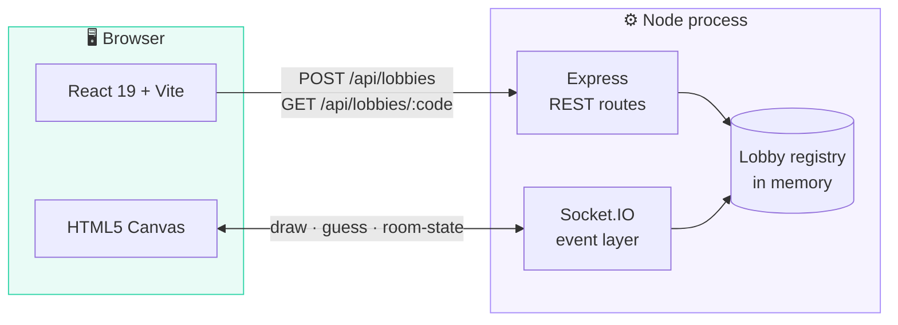
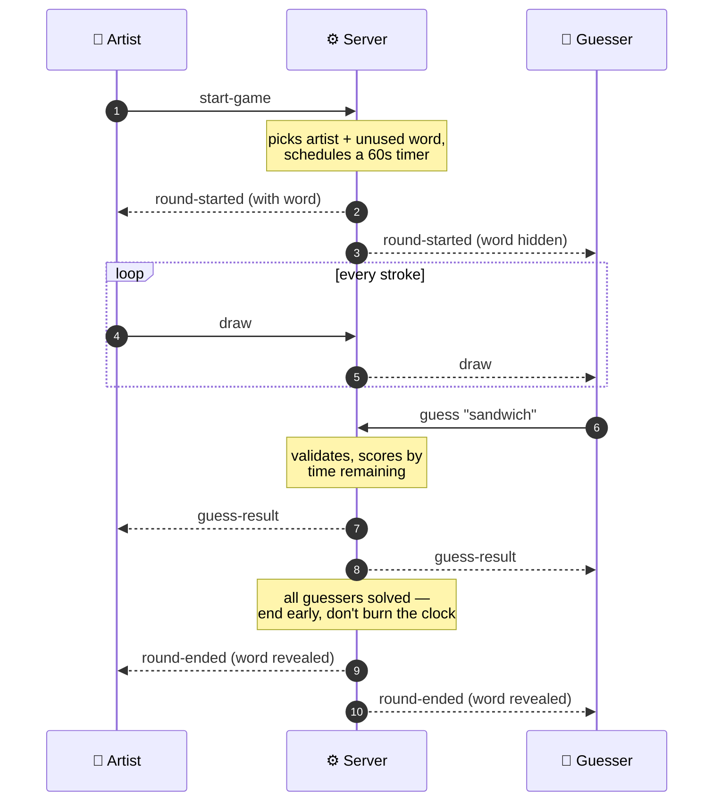

<div align="center">

# 🎨 Sketch &amp; Guess

### One canvas. One secret word. A room full of terrible guesses.

A real-time multiplayer drawing game — one player draws, everyone else races to guess.

[](https://react.dev)
[](https://vite.dev)
[](https://nodejs.org)
[](https://socket.io)
[](#-testing)
[](LICENSE)

<br>



<sub><i>Left: the artist drawing. Right: the guesser watching it appear live. Same room, same moment.</i></sub>

</div>

<br>

## ⚡ Play in 30 seconds

```bash
git clone https://github.com/abhadre66/Build_fellowship.git
cd Build_fellowship
npm install
npm run dev
```

Open **http://localhost:5173** in two browser tabs — create a room in one, paste the code into the other, and you're playing.

> [!TIP]
> The room code sits in the header with a one-click copy button. That's what you send your friends.

<br>

## 🎮 How a round works

| | | |
|:--|:--|:--|
| **1** | **Someone creates a room** | You get a six-character code to share. Anyone with it can join. |
| **2** | **The host starts the game** | The server shuffles a turn order so everyone draws exactly once, then picks a secret word and starts a 60-second clock. |
| **3** | **The artist draws** | Seven colours, three pencil weights, an eraser. Every stroke streams to the room as it happens. |
| **4** | **Everyone else guesses** | Correct guesses score `time remaining × 10`. Wrong guesses stay private — no accidental spoilers. |
| **5** | **The artist scores too** | They earn the **average of what the solvers scored**, so drawing clearly is worth as much as guessing fast. Nobody guesses, nobody earns. |
| **6** | **The round closes** | On the timer, or **the instant everyone has solved it**. Then the next artist is up. |

One round per player, 2–8 players, and a 30-word pool that won't repeat a word until it's been through the whole list. A game is over once everyone has had the pen.

<br>

## 🌗 Ships in light and dark

Your choice is remembered between visits, and defaults to your system preference.



<br>

## 🧠 How it works

<details>
<summary><b>Architecture — two halves, one deployed process</b></summary>

<br>



**REST** handles the things that happen once — creating a room, checking a code exists. **WebSockets** handle everything during a round, because that's where latency actually shows.

In production it's a **single service**: the same Node process serves the API, the socket layer, and the built React client, so there's one thing to deploy and no cross-origin setup to get wrong.

</details>

<details>
<summary><b>Anatomy of a round — who decides what</b></summary>

<br>



The important part: **the client never decides anything.** It renders what the server tells it. Emitting `start-game` is a *request* — the server still checks you're the host and that there are enough players before a round begins.

</details>

<details>
<summary><b>The domain model — four classes hold the game</b></summary>

<br>

| Class | Responsibility |
|:--|:--|
| **`Lobby`** | The room. Holds players and the current round; decides when a round ends versus when the whole game does. |
| **`Round`** | One turn. Holds the artist, a word not yet used this game, who has solved it, and what they scored. |
| **`Player`** | Identity, score, host flag, and a `connected` flag — the last one is what makes reconnects survivable. |
| **`CanvasState`** | The stroke log for the round, so anyone joining or reconnecting mid-draw sees the drawing already in progress. |

All four live in [`server/domain.js`](server/domain.js) with no framework imports, which is exactly why they're straightforward to unit test.

</details>

<details>
<summary><b>API &amp; event reference</b></summary>

<br>

**REST** — rate limited to 20 requests/minute per IP

| Method | Route | Purpose |
|:--|:--|:--|
| `POST` | `/api/lobbies` | Create a room. Body: `{ "name": "Abhishek" }` → `{ code, playerId }` |
| `GET` | `/api/lobbies/:code` | Public room state, or `404` if the code is unknown |
| `GET` | `/api/health` | Liveness check |

**Client → server** — requests, not commands

`join-room` · `start-game` · `draw` · `clear-canvas` · `guess` · `next-round`

**Server → clients** — the authoritative truth

`room-state` · `round-started` · `round-ended` · `game-ended` · `draw` · `canvas-cleared` · `guess-result`

Socket events are throttled per connection too — draws and guesses both have caps, so a public URL can't be spammed into the ground.

</details>

<details>
<summary><b>Project structure</b></summary>

<br>

```
├── server/
│   ├── domain.js        Game rules — Lobby, Round, Player, CanvasState
│   ├── domain.test.js   10 unit tests covering those rules
│   └── index.js         Express routes, Socket.IO handlers, static serving
├── src/
│   ├── App.jsx          Lobby, canvas, chat, leaderboard, theming
│   ├── main.jsx         React entry point
│   └── styles.css       Design tokens + light/dark themes
├── docs/                README assets
└── vite.config.js
```

</details>

<br>

## 🛡️ Built for real players

Things that only matter once actual people are in the room:

- **Reconnects** — refresh mid-round and you're back with your score intact. You get a 30-second grace window before the room gives up on you.
- **Host handoff** — if the host leaves for good, the next player is promoted so the room isn't stranded.
- **Early round end** — the moment the last guesser gets it, the round closes instead of burning the clock.
- **Server-owned timers** — one clock, held by the server, so nobody's browser disagrees about how long is left.
- **Rate limiting** — on room creation and on socket traffic, because this is meant to go on a public URL.

<br>

## 🧪 Testing

```bash
npm test
```

Thirteen Vitest tests aimed at the **game rules** rather than the plumbing:

- ✅ Scoring on a correct guess
- ✅ The artist can't guess their own word
- ✅ No double-scoring from one player
- ✅ Every non-artist solving it flags the round to end early
- ✅ **Every player draws exactly once, then the game ends**
- ✅ **A player who leaves is skipped rather than stranding the round**
- ✅ **The artist earns the average of the solvers' points**
- ✅ **The artist earns nothing when nobody guesses**
- ✅ The word pool doesn't repeat until exhausted
- ✅ Round-end versus game-end transitions
- ✅ Host promotion when the host leaves

These are the things that would quietly ruin a game if they broke.

<br>

## 🚀 Deploying

Ships as a **single Node web service** — Express serves the API, Socket.IO, and the built client from one process.

| Setting | Value |
|:--|:--|
| Build command | `npm install && npm run build` |
| Start command | `npm start` |
| Node version | 18+ |

**Environment variables** (see [`.env.example`](.env.example)):

- `CLIENT_ORIGIN` — set to your deployed URL to lock down CORS instead of leaving it open
- `VITE_API_URL` — only needed if the client and API live on different origins; leave unset for the single-service setup

<br>

## 🗺️ Roadmap

- [ ] **Shared state store** — rooms live in memory, so they reset on redeploy and won't scale past one instance. Redis is the fix.
- [ ] **Word visibility** — the word currently reaches every client so the reveal works locally; it should go only to the artist until the round ends.
- [ ] **Spectators & late joins** — right now you join before the game starts.
- [ ] **Word packs** — categories and custom room lists instead of one flat pool.
- [ ] **Richer canvas** — fill tool, undo, a wider brush range.

<br>

## 📄 License

MIT — see [LICENSE](LICENSE).

<div align="center">
<br>
<sub>Built by <b>Abhishek Bhadre</b> for the Build Fellowship.</sub>
</div>
